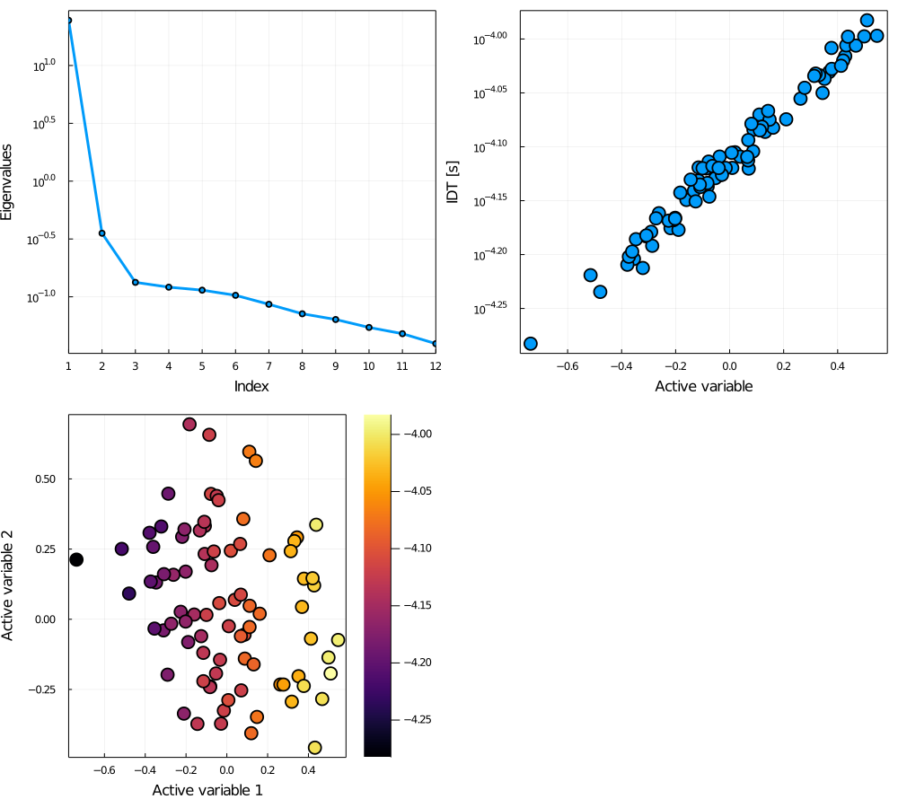

# ArrheniusActiveSubspace
Use `Arrhenius.jl` to compute active subspace

Active subspace is an elegant approach for uncertainty quantification of combustion models, by exploring the low-dimensional structure in the model parameter space. It identifies the subspace using the sensitivity information of the quantity of interest. It is historically challenging to compute the sensitivity for ignition delay. Thanks to recent advances in the sensitivity algorithms and the auto-differentiation in `Arrhenius.jl`, we are now able to compute the sensitivity quite efficiently.

This repo demonstrates the capability in computing the active subspace for an n-heptane mechanism with near 5000 reactions, which has never been achieved before.

### sensBVP

The core functionally is the function of `sensBVP_mthread(ts, pred, p)` located in the file `sensBVP.jl`. It exploits following computational techniques:

+ auto-differentiation
+ banded matrix
+ multi-thread paralleliration
+ sensBVP method

The following plot shows the Eigen spectrum for the n-heptane model under 1400 K, 40 atm, equivalence ratio of one, with sensitivities calculated by [sensBVP method](#sensBVP).

### sensBF

BTW, sensitivity here can also be calculated by brute-forece method, which is also implemented in `sensBF_mthreads` function. To obtain active subspace, one can only solve sensitivities for sensitive or important reactions, when using brute-force method.

The following plot shows the Eigen spectrum for the H2 model under 1200 K, 10 atm, equivalence ratio of one, with sensitivities calculated by brute-force method.

## Roadmap

+ Two-stages pipleline: select active parameters with local sensitivities and then compute active subspace within active variables. This could greatly reduce the computational cost of evaluating the parameter Jacobian and the cost of solving the linear systems. (Easy)

+ Exploiting the sparsity of the two Jacobians, especially the parameter Jacobian, which is very sparse for large mechanisms. (Medium)

+ Investigate the downsampling straightgies and the effect of ignition temperature (Easy)

## References

### active subspace

* Ji, Weiqi, Zhuyin Ren, Youssef Marzouk, and Chung K. Law. "Quantifying kinetic uncertainty in turbulent combustion simulations using active subspaces." Proceedings of the Combustion Institute 37, no. 2 (2019): 2175-2182.
* Ji, Weiqi, Jiaxing Wang, Olivier Zahm, Youssef M. Marzouk, Bin Yang, Zhuyin Ren, and Chung K. Law. "Shared low-dimensional subspaces for propagating kinetic uncertainty to multiple outputs." Combustion and Flame 190 (2018): 146-157.

### Sensitiivty of ignition delay

* Gururajan, Vyaas, and Fokion N. Egolfopoulos. "Direct sensitivity analysis for ignition delay times." Combustion and Flame 209 (2019): 478-480.[\[sensBVP method\]](#sensBVP)

* Ji, Weiqi, Zhuyin Ren, and Chung K. Law. "Evolution of sensitivity directions during autoignition." Proceedings of the Combustion Institute 37, no. 1 (2019): 807-815.

### Auto-differentiation

* Revels, Jarrett, Miles Lubin, and Theodore Papamarkou. "Forward-mode automatic differentiation in Julia." arXiv preprint arXiv:1607.07892 (2016).